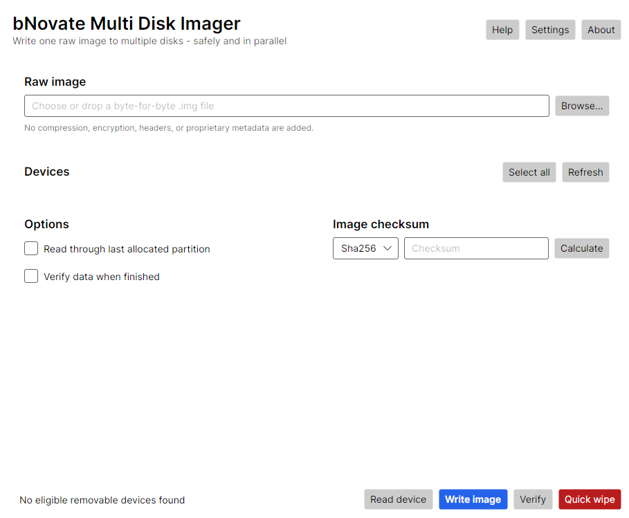

<p align="center">
  
</p>

<h1 align="center">bNovate Multi Disk Imager</h1>

<p align="center">
  Read, write, and verify raw disk images on Windows, macOS, and Linux.
</p>

<p align="center">
  <a href="https://github.com/ashajkofci/multi-disk-imager/releases/latest">Download the latest release</a>
  · <a href="README-COMMERCIAL.md">Product overview</a>
  · <a href="https://www.bnovate.com">bNovate Technologies</a>
</p>



## Highlights

- Write one image to multiple devices in parallel.
- Read a physical device to a standard, byte-for-byte `.img` file.
- Verify devices and report the first mismatching byte.
- Calculate MD5, SHA-1, and SHA-256 checksums.
- Read only through the last allocated MBR or GPT partition.
- Track per-device progress, speed, throughput, and remaining time.
- Quick-wipe partition and filesystem metadata.

Images stay portable: the app adds no compression, encryption, headers, or proprietary metadata.

## Safety

The system disk is never offered as a target. Before writing or wiping, the app revalidates each device and shows its model, capacity, and platform identifier for confirmation.

> [!WARNING]
> Writing or wiping a disk destroys data. Always confirm every selected device and keep backups.

## Download and install

Download the package for your system from [GitHub Releases](https://github.com/ashajkofci/multi-disk-imager/releases/latest).

| Platform | Package |
| --- | --- |
| Windows 10+ x64 | Setup `.exe` (recommended), portable `.exe`, or unsigned `.msix` |
| macOS 12+ Intel | `.dmg` |
| macOS 12+ Apple Silicon | `.dmg` |
| Ubuntu 22.04+ x64 | `.deb` (`amd64`) |
| Ubuntu 22.04+ ARM64 | `.deb` (`arm64`) |

Install a downloaded Linux package with:

```bash
sudo apt install ./bnovate-multi-disk-imager-*-linux-x64.deb
```

Use `linux-arm64` in the filename on ARM64. The package installs the app-menu entry, command-line launcher, icon, and required system dependencies. Administrator approval is requested only when raw-device access begins.

Windows and macOS releases are not commercially signed, so SmartScreen or Gatekeeper may warn on first launch. On macOS, open the DMG, drag the app to **Applications**, then Control-click the app and choose **Open**.

<details>
<summary><strong>Command-line options</strong></summary>

```text
MultiDiskImager [image.img] [options]
  -i, -image, --image PATH       Select a raw image file
  -d, -device, --device ID ...  Select platform device IDs
  -r, -read, --read             Read one device to the image
  -w, -write, --write           Write the image to selected devices
  -v, -verify, --verify         Verify, or verify after read/write
  -oa, -onlyallocated, --only-allocated
                                Stop at the last allocated partition
  -s, -start, --start           Start after validation
      --version                 Print the version
      --list-devices            List detected physical devices and exit
  -h, --help                    Show help
```

</details>

<details>
<summary><strong>Build from source</strong></summary>

The app targets .NET 8. Avalonia 12's source generators require the .NET 10 SDK to build it.

```bash
dotnet restore MultiDiskImager.sln --locked-mode -m:1
dotnet build MultiDiskImager.sln -c Release --no-restore -m:1
dotnet test MultiDiskImager.sln -c Release --no-build
```

Linux `.deb` packages are built with `scripts/package-linux.sh`. Release artifacts and their hashes are generated automatically from SemVer tags such as `v1.2.3`.

</details>

## Languages

The app follows the operating-system language and includes English, French, German, Italian, Spanish, Portuguese, Dutch, Polish, Simplified Chinese, and Japanese.

## License

[MIT](LICENSE) © 2026 bNovate Technologies SA. Author: Adrian Shajkofci.
